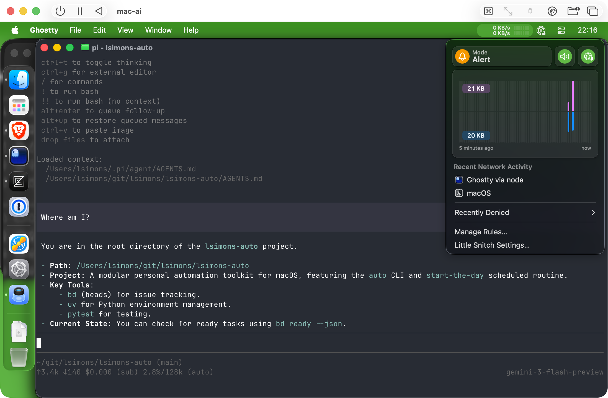
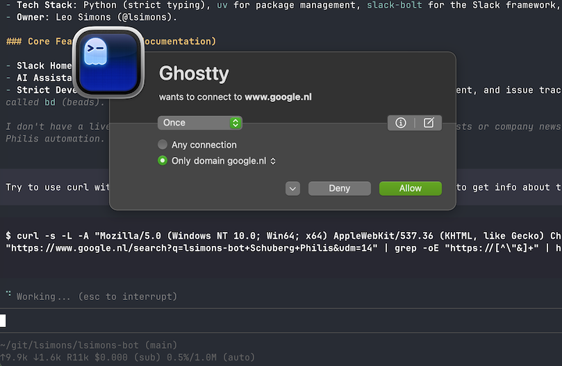

# Setting Up a Sandboxed VM for Agentic Coding

A guide to running AI coding agents in a controlled, sandboxed macOS environment using UTM virtualization.

This describes how I've set up [lsimons-bot](https://lsimonsbot.wordpress.com).



## Why?

When using autonomous coding agents (especially in YOLO mode), you want:

- **Network control**: Little Snitch in alert mode lets you selectively and interactively approve network traffic
- **Isolation**: The agent runs in a VM it probably can't escape, even if it tries
- **Scoped access**: Can use GitHub (via `gh` CLI) and 1Password (via `op` CLI) but only for designated accounts
- **Damage limitation**: Even a misbehaving agent can't do much harm

This setup is for experimenting with agentic coding tools before using them on production projects.

## Prerequisites

- A Mac with enough resources to run a VM (8GB+ RAM recommended)
- A separate "bot" account for GitHub and 1Password (recommended)

## Setting up an agent profile

Using a distinct or an incognito browser, for the new bot...

* Give it a name and a profile picture
* Create a Google Workspace account
* Create a 1Password Family account
* Create SSH key and add them to 1Password
* Create and configure a GitHub account
* Set up 1Password passkeys for GitHub and Google
* Invite the bot to collaborate on GH repositories
* Fork GH repositories into the bot account

## Setting up co-authored-by

Change your AGENTS.md file(s) to write git commits that include the bot as a co-author.

### Set the git co-author

When you make git commits, you must always attribute the co-author. At the end of every git commit message, add two extra newlines and then a Co-authored-by line.

To determine who your co-author is, check your git user.email with: `git config get user.email`. If you are bot@leosimons.com, then your co-author line should be the human author:

```
Co-authored-by: Leo Simons <mail@leosimons.com>
```

If instead you are mail@leosimons.com, or another human user, then your co-author line should be the bot author:

```
Co-authored-by: lsimons-bot <bot@leosimons.com>
```

A good example of a commit message (Leo as author, so lsimons-bot as co-author):

```
Author: Leo Simons <mail@leosimons.com>
Date:   Fri Jan 2 16:49:26 2026 +0100

    feat(git_sync): Add hostname filter to OwnerConfig (lsa-tsl)

    Co-authored-by: lsimons-bot <bot@leosimons.com>
```

Another good example would be (lsimons-bot as author, so Leo as co-author):

```
Author: lsimons-bot <bot@leosimons.com>
Date:   Fri Jan 2 16:49:26 2026 +0100

    feat(git_sync): Add hostname filter to OwnerConfig (lsa-tsl)

    Co-authored-by: Leo Simons <mail@leosimons.com>
```

A BAD example is (lsimons-bot can't be both author and co-author):

```
Author: lsimons-bot <bot@leosimons.com>
Date:   Fri Jan 2 16:49:26 2026 +0100

    feat(git_sync): Add hostname filter to OwnerConfig (lsa-tsl)

    Co-authored-by: lsimons-bot <bot@leosimons.com>
```

## Setting up an agent coding VM

### 1. Create the Virtual Machine

1. Download and install [UTM](https://mac.getutm.app/)
2. Create a new macOS virtual machine (allocate generous CPU/RAM)
3. Download and install macOS in the VM
4. Create a new user account

### 2. Tune macOS Settings

Configure for usability and to distinguish from your main environment:

- Disable animations (for performance)
- Set dark mode
- Set trackpad preferences
- Set keyboard preferences
- Cleanup and tune UI
- **Set a distinct desktop background/theme** — you want to always know you're in the sandbox

### 3. Install Little Snitch (Network Firewall)

1. Download, install, and register [Little Snitch](https://www.obdev.at/products/littlesnitch/)
2. Add a blocklist: `https://raw.githubusercontent.com/hagezi/dns-blocklists/main/adblock/light.txt`
3. Start in **alert mode** to interactively approve/deny connections

This is the key security control — you'll see and approve every network connection the agent tries to make.

### 4. Install Pareto Security (Security Checks)

Free security auditing for macOS:
1. Install from [https://paretosecurity.com/mac](https://paretosecurity.com/mac)
2. Disable checks that don't apply (Time Machine, user-is-admin)
3. Run all checks, follow remediation steps, rerun until green

### 5. Install dotfiles

Follow instructions from [README.md](../README.md).

### 6. Configure Browser and Accounts

1. Make Brave the default browser and configure its settings
2. Sign into your bot 1Password account at https://my.1password.eu/
3. Set up 1Password Browser Extension, Desktop App, and CLI
4. Sign into your bot email account at https://mail.google.com/

### 6. Configure Git and SSH

1. Open Zed and log in with bot GitHub account
2. Copy over bot SSH keys
3. Set up 1Password developer mode, configure git to use 1Password SSH key

### 7. Set up Workspace

```bash
mkdir -p ~/git
cd ~/git
gh auth login
gh repo clone <your-repos>
```

## First Run

1. Navigate to a git repo
2. Run `pi init`, use `/login` to authenticate GitHub/Google/OpenAI, pick model
3. Run `git pull` to verify the model can talk to GitHub
4. Configure allow rules in Little Snitch as needed
5. Switch Little Snitch to **alert mode**
6. Verify alerts appear when the agent tries network access:



## References

- [UTM - Virtual machines for Mac](https://mac.getutm.app/)
- [Little Snitch - Network monitor](https://www.obdev.at/products/littlesnitch/)
- [pi-coding-agent](https://shittycodingagent.ai/)
- [Pareto Security](https://paretosecurity.com/mac)
