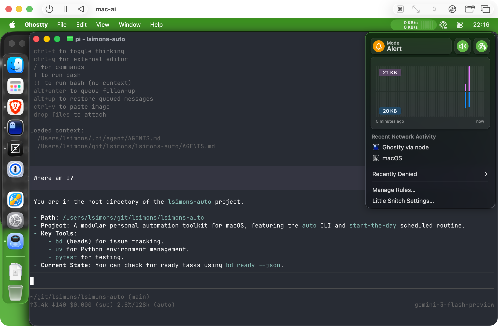
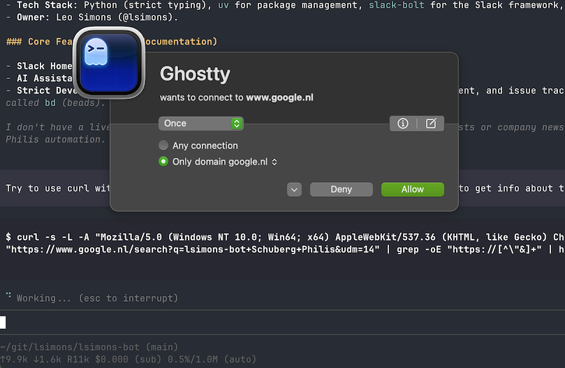

# Setting Up a Sandboxed VM for Agentic Coding

A guide to running AI coding agents in a controlled, sandboxed macOS environment using UTM virtualization.

This describes how I've set up [lsimons-bot](https://lsimonsbot.wordpress.com).



## Why?

When using autonomous coding agents (especially in YOLO mode), you want:

- **Network control**: Little Snitch in alert mode lets you selectively and interactively approve network traffic
- **Isolation**: The agent runs in a VM it probably can't escape, even if it tries
- **Scoped access**: Can use GitHub (via `gh` CLI) and 1Password (via `op` CLI) but only for designated accounts
- **Damage limitation**: Even a misbehaving agent can't do much harm

This setup is for experimenting with agentic coding tools before using them on production projects.

## Prerequisites

- A Mac with enough resources to run a VM (8GB+ RAM recommended)
- A separate "bot" account for GitHub and 1Password (recommended)

## Setting up an agent profile

Using a distinct or an incognito browser, for the new bot...

* Give it a name and a profile picture
* Create a Google Workspace account
* Create a 1Password Family account
* Create SSH key and add them to 1Password
* Create and configure a GitHub account
* Set up 1Password passkeys for GitHub and Google
* Invite the bot to collaborate on GH repositories
* Fork GH repositories into the bot account

## Setting up co-authored-by

Change your AGENTS.md file(s) to write git commits that include the bot as a co-author.

Always add a Co-authored-by line. Check `git config --get user.email` to determine authorship:
- If you're `bot@leosimons.com`: add `Co-authored-by: Leo Simons <mail@leosimons.com>`
- If you're `mail@leosimons.com` (or other human): add `Co-authored-by: lsimons-bot <bot@leosimons.com>`

Example:
```
feat(git_sync): Add hostname filter to OwnerConfig

Co-authored-by: lsimons-bot <bot@leosimons.com>
```

## Setting up an agent coding VM

### 1. Create the Virtual Machine

1. Download and install [UTM](https://mac.getutm.app/)
2. Create a new macOS virtual machine (allocate generous CPU 2+/RAM 8GB+/Disk 60GB+)
3. Download and install macOS in the VM
4. Create a new user account

### 2. Tune macOS Settings

Configure for usability and to distinguish from your main environment:

- Set hostname (see [machines](../machines/))
- Disable animations (for performance)
- Set dark mode
- Set trackpad preferences
- Set keyboard preferences
- Cleanup and tune UI
- **Set a distinct desktop background/theme** — you want to always know you're in the sandbox

### 3. Install Little Snitch (Network Firewall)

1. Download, install, and register [Little Snitch](https://www.obdev.at/products/littlesnitch/)
2. Add a blocklist: `https://raw.githubusercontent.com/hagezi/dns-blocklists/main/adblock/light.txt`
3. Start in **alert mode** to interactively approve/deny connections

This is the key security control — you'll see and approve every network connection the agent tries to make.

### 4. Install Pareto Security (Security Checks)

Free security auditing for macOS:
1. Install from [https://paretosecurity.com/mac](https://paretosecurity.com/mac)
2. Disable checks that don't apply (Time Machine, user-is-admin)
3. Run all checks, follow remediation steps, rerun until green

### 5. Configure 1Password

1. Download, install and configure [1Password](https://1password.com/downloads/mac)
2. Sign into your bot 1Password account
3. Open 1Password preferences > Developer
4. Check "Show 1Password Developer experience"
5. Check "Use the SSH agent"
6. Check "Integrate with 1Password CLI"

### 6. Install dotfiles

Set up everything else:

```bash
mkdir -p ~/git/lsimons
cd ~/git/lsimons
git clone https://github.com/lsimons/lsimons-dotfiles.git
cd lsimons-dotfiles
python3 script/install.py
```

First attempt to run `git` will prompt download/install of XCode Developer Tools. Install.
Second run may stutter a bit.
So, open up a fresh new Ghostty, and run `python3 script/install.py` once again.

To save disk space:
```bash
brew cleanup --prune=all
rm -r ~/Downloads/*
```

This is a good time to make a VM snapshot/copy. Before you do:

1. Ensure 1Password is signed out
2. Ensure iCloud is signed out
3. `rm ~/.zsh_history`
4. Open Safari > Settings > Privacy > Manage website data... and delete all website data
5. Open Safari, in the main menu, select "Clear History..." and delete all history

### 7. Set up SSH signing key

1. Open 1Password, find bot SSH signing key
2. Click 'export', export with the right password
3. Save as `~/.ssh/ai_ed25519`

### 7. Configure Browser and Accounts

1. Make Vivaldi the default browser and configure its settings
2. Sign into your bot 1Password account at https://my.1password.eu/
3. Set up 1Password Browser Extension, Desktop App, and CLI
4. Sign into your bot email account at https://mail.google.com/

### 8. Set up Workspace

```bash
cd ~/git
# mkdir $org; cd $org
gh auth login
gh repo clone <your-repos>
```

### 9. Set up lsimons-auto

```bash
cd ~/git/lsimons
git clone https://github.com/lsimons/lsimons-auto.git
cd lsimons-auto
python install.py
/Users/lsimons/.local/bin/start-the-day
```

## First Run

1. Navigate to a git repo
2. Run `pi init`, use `/login` to authenticate GitHub/Google/OpenAI, pick model
3. Run `git pull` to verify the model can talk to GitHub
4. Configure allow rules in Little Snitch as needed
5. Switch Little Snitch to **alert mode**
6. Verify alerts appear when the agent tries network access:



## References

- [UTM - Virtual machines for Mac](https://mac.getutm.app/)
- [Little Snitch - Network monitor](https://www.obdev.at/products/littlesnitch/)
- [pi-coding-agent](https://shittycodingagent.ai/)
- [Pareto Security](https://paretosecurity.com/mac)
- [Agent sandbox trust model](./AGENT_SANDBOX_TRUST_MODEL.md) — what the
  Claude/Codex sandbox itself (as distinct from this VM) is allowed to
  touch on the host, and why
